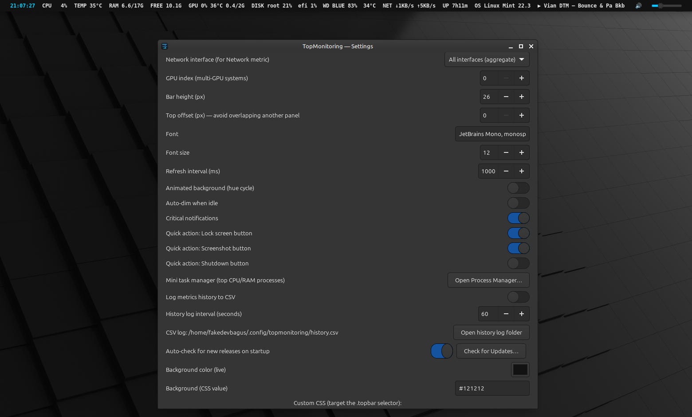

# TopMonitoring

[](https://github.com/fakedevbagus/TopMonitoring-linux/actions/workflows/ci.yml)
[](LICENSE)
[](https://www.rust-lang.org/)
[](https://github.com/fakedevbagus/TopMonitoring-linux)

A fast, native, and deeply customizable GTK4 system-monitor topbar for Linux.
It reserves real screen space through layer-shell on Wayland or EWMH struts on
X11 instead of covering maximized windows.



## TopMonitoring 3 alpha

Version **3.0.0-alpha.5** completes the implementation side of approved Phase
3. Alpha.1 through alpha.4 passed their terminal, smoke, and manual gates.

- **More is always clickable**, including an empty-state explanation when all
  enabled modules fit on the bar.
- A persistent global search finds Settings pages, controls, all 38 built-ins,
  aliases such as HDD/Wi-Fi, and custom names, labels, and commands.
- The unified compact catalog filters Enabled/Disabled, Built-in/Custom, and
  category, while only the selected module's full editor is constructed.
- Selection survives filtering; no-result states explain how to recover.
- Ctrl+F focuses search and Esc clears it without discarding configuration.
- Narrow Settings windows replace the sidebar with compact navigation and stack
  the catalog/editor panes vertically.

This is a source-test alpha, not the final v3 `.deb`. Run formatting, all **44
unit tests**, strict Clippy, the locked no-Wayland release build, smoke, and the
Phase 3B manual matrix in `docs/TESTING.md`. Visual effects remain blocked until
this complete Phase 3 gate passes.

## What is new in 2.0

- **Calm Telemetry visual system** with semantic accent, surface, warning, and
  critical colors; density controls; per-module foreground/background; and
  reduced-motion support.
- **Three layout zones** (`start`, `center`, `end`) with per-module priority,
  compact mode, custom labels, and `{label}` / `{value}` display templates.
- **Redesigned Settings** with Overview, Bars & layout, Appearance, Built-in
  modules, Custom modules, and Data & tools pages plus persistent Save,
  Discard, and Reset actions.
- **Non-blocking external-provider snapshots** for audio, brightness, Wi-Fi,
  Bluetooth, media, package updates, and update checks. User actions run on a
  separate high-priority lane so slow package scans cannot delay Lock.
- **Bounded custom commands** with per-module interval, timeout, output cap,
  global concurrency limit, exit-state feedback, explicit trust controls, on-
  demand Run now refreshes, and one-click duplication.
- **Safe configuration import**: imported executable behavior is disabled and
  untrusted until the local user reviews it.
- **Correct rate math and hardware behavior**: network/disk rates account for
  elapsed time, network totals honor the selected interface, CPU frequency is
  averaged across logical CPUs, and X11 geometry avoids signed underflow.
- **Real quick actions** for lock, screenshot, and poweroff; poweroff requires
  a second click within four seconds.
- **Resilient persistence** with schema migration, validation, atomic `0600`
  config writes, separate base/user CSS providers, bounded CSV rotation, and a
  non-blocking history dashboard with chart, statistics, export, and clear.

The full audit and implementation rationale are in
[`AUDIT_MAJOR_UPGRADE_PLAN.md`](AUDIT_MAJOR_UPGRADE_PLAN.md).

## Metrics and controls

CPU, per-core detail, frequency, package power, memory, swap, temperature,
fans, NVIDIA/AMD/Intel GPU data, mounted disks, disk I/O, network rates and
totals, battery, Wi-Fi, VPN, Bluetooth, package updates, media, process count,
uptime, load, host/kernel/OS, audio, brightness, sparklines, hardware sensors,
and a mini process manager.

Optional tools degrade gracefully:

| Capability | Preferred tools |
|---|---|
| Audio | `wpctl`, fallback `pactl` |
| Brightness | `brightnessctl`, fallback readable/writable sysfs |
| Wi-Fi | `nmcli` |
| Bluetooth | `bluetoothctl` |
| Media | `playerctl` |
| Packages | `apt`, `dnf`, `checkupdates` (Pacman), and/or `flatpak` |
| Notifications | `notify-send` |
| Release checks | `curl` |
| Screenshots | GNOME Screenshot, XFCE Screenshooter, Spectacle, or Flameshot |
| Session lock | Cinnamon/GNOME/KDE/Xfce/MATE locker, XDG, then logind fallback |

## Install

### Debian package

Download the release `.deb`, then:

```bash
sudo apt install ./topmonitoring_2.0.1_*.deb
```

The 2.0.1 package supersedes the legacy `topmonitoring-no-wayland` package.
APT can remove that legacy package during the upgrade; user configuration under
`~/.config/topmonitoring` is retained.

### Build from source on Ubuntu/Debian

```bash
sudo apt update
sudo apt install -y build-essential pkg-config libgtk-4-dev \
  libgtk4-layer-shell-dev libsensors-dev lm-sensors

git clone https://github.com/fakedevbagus/TopMonitoring-linux.git
cd TopMonitoring-linux
./install.sh
```

Use an X11-only build when layer-shell headers are unavailable:

```bash
TOPMONITORING_NO_WAYLAND=1 ./install.sh
# or: cargo build --release --locked --no-default-features
```

The installer uses `/usr/local` by default. Override it with `PREFIX`.
`./uninstall.sh` removes installed program files but deliberately keeps user
configuration.

## Use

- Click **Settings** on the bar, or right-click the bar.
- Changes preview live. **Save changes** persists them; **Discard** restores
  the last saved snapshot.
- Middle-click a metric for detail.
- Drag Audio/Light controls; audio's button toggles mute.
- Send `SIGUSR1` to toggle bar visibility:
  `pkill -SIGUSR1 topmonitoring`.

Configuration is stored at `~/.config/topmonitoring/config.toml`; history is at
`~/.config/topmonitoring/history.csv` and rotates to `history.csv.1` at the
configured size.

### Custom-command safety

Custom modules are local shell commands. Keep timeouts short and output caps
small. Importing a configuration never grants trust: review both the polling
command and click action, then enable **Trusted** explicitly. TopMonitoring
never invokes `sudo` for a custom module or update check.

## Development and release gates

For an installed no-Wayland setup, test the candidate directly from the source
tree with an isolated profile; the stable package remains installed:

```bash
./scripts/test-no-wayland.sh check
pkill -x topmonitoring || true
./scripts/test-no-wayland.sh smoke
./scripts/test-no-wayland.sh manual
```

Only after the manual X11 checklist passes, create the package:

```bash
./scripts/package-no-wayland.sh --confirmed-manual
```

CI also executes Wayland-enabled and no-Wayland test/build matrices. Every
update must satisfy the documentation matrix before packaging or GitHub
publication.

See [`docs/TESTING.md`](docs/TESTING.md),
[`RELEASE_CHECKLIST.md`](RELEASE_CHECKLIST.md),
[`docs/TECHNICAL.md`](docs/TECHNICAL.md), [`MIGRATION_V2.md`](MIGRATION_V2.md),
[`CHANGELOG.md`](CHANGELOG.md), and [`SECURITY.md`](SECURITY.md).

## License

[MIT](LICENSE)
